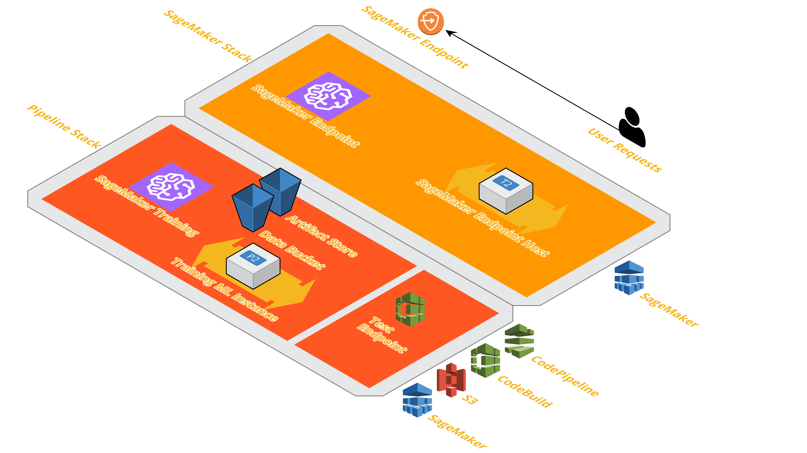

# SageMaker Pipeline
## Introduction

This is a sample solution using a SageMaker pipeline.  This implementation could be useful for any organization trying to automate their use of Machine Learning.  With an implementation like this, any inference is easy, and can simply be queried through an endpoint to receive the output of the model’s inference, tests can be automatically performed for QA, and ML code can be quickly updated to match needs.

## Prerequisites
- **AWS account** – Follow these instructions to create an AWS Account: [Create an AWS Account](http://docs.aws.amazon.com/AmazonSimpleDB/latest/DeveloperGuide/AboutAWSAccounts.html)
- **GitHub OAuth Token** – Follow these instructions to create an OAuth Token: [Create a GitHub OAuth Token](https://github.com/stelligent/devops-essentials/wiki/Prerequisites#create-an-oauth-token-in-github)

## Architecture and Implementation
###  Architecture Diagram

###  Components Details
  - [**AWS CloudFormation**](https://aws.amazon.com/cloudformation/) – This solution uses the CloudFormation Template language, in either YAML or JSON, to create each resource.
  - [**AWS CodeBuild**](https://aws.amazon.com/codebuild/) – This solution uses CodeBuild to build the source code from GitHub
  - [**AWS CodePipeline**](https://aws.amazon.com/codepipeline/) – CodePipeline has various stages defined in CloudFormation which step through which actions must be taken in which order to go from source code to creation of the production endpoint.
  - [**AWS EC2**](https://aws.amazon.com/ec2/) – EC2 Instances are created in order to train the model as well as host the model to be accessed via and endpoint.  
  - [**AWS SageMaker**](https://aws.amazon.com/sagemaker/) – This solution uses SageMaker to train the model to be used and host the model at an endpoint, where it can be accessed via HTTP/HTTPS requests
  - [**AWS IAM**](https://aws.amazon.com/iam/) – Separate Identity and Access Management (IAM) Roles are created for the pipeline, CodeBuild, and CloudFormation.
  - [**AWS SNS**](https://aws.amazon.com/sns/) – This solution uses a Simple Notification Service (SNS) Topic in order to approve movement into production after testing.
  - [**AWS S3**](https://aws.amazon.com/s3/) – Artifacts created throughout the pipeline as well as the data for the model is stored in an Simple Storage Service (S3) Bucket.

## CloudFormation Templates resources
  - **AWS CloudFormation** – [AWS::CloudFormation::Interface](https://docs.aws.amazon.com/AWSCloudFormation/latest/UserGuide/aws-resource-cloudformation-interface.html) sets parameter group metadata.
  - **AWS CodeBuild** – [AWS::CodeBuild::Project](https://docs.aws.amazon.com/AWSCloudFormation/latest/UserGuide/aws-resource-codebuild-project.html) uploads the project source code stored in GitHub to an S3 bucket.
  - **AWS CodePipeline** – [AWS::CodePipeline::Pipeline](https://docs.aws.amazon.com/AWSCloudFormation/latest/UserGuide/aws-resource-codepipeline-pipeline.html) – Easiest to create the Pipeline in the AWS Console, then use the get-pipeline CLI command to get the configuration in JSON to be placed into the CloudFormation Template.
  - **AWS EC2** – Instance type specified in [AWS::SageMaker::EndpointConfig](https://docs.aws.amazon.com/AWSCloudFormation/latest/UserGuide/aws-resource-sagemaker-endpointconfig.html)
  - **AWS SageMaker** – [AWS::SageMaker::Model](https://docs.aws.amazon.com/AWSCloudFormation/latest/UserGuide/aws-resource-sagemaker-model.html) – here the algorithm to be used by SageMaker is specified, as well as the source code to be submitted to once the model has been created;

    [AWS::SageMaker::Endpoint](https://docs.aws.amazon.com/AWSCloudFormation/latest/UserGuide/aws-resource-sagemaker-endpoint.html) – this is the endpoint from which you can make requests;

    [AWS::SageMaker::EndpointConfig](https://docs.aws.amazon.com/AWSCloudFormation/latest/UserGuide/aws-resource-sagemaker-endpointconfig.html)– here we specify key configurations for the endpoint, including the type of EC2 instance used, and can specify if we would like multiple endpoint models, e.g. for A-B testing, and similarly how much/what traffic we will direct to this endpoint.
  - **AWS IAM** – [AWS::IAM::Role](https://docs.aws.amazon.com/AWSCloudFormation/latest/UserGuide/aws-resource-iam-role.html) – Make sure to specify only the necessary permissions for each role.
  - **AWS SNS** – [AWS::SNS::Topic](https://docs.aws.amazon.com/AWSCloudFormation/latest/UserGuide/aws-properties-sns-topic.html) – sends a confirmation to the email specified as a parameter.
  - **AWS S3** – [AWS::S3::Bucket](https://docs.aws.amazon.com/AWSCloudFormation/latest/UserGuide/aws-properties-s3-bucket.html) – stores the model data and necessary artifacts

## Costs
This section outlines cost considerations for running a SageMaker Pipeline. Running the default pipeline for 24 hours will cost roughly $1.76 including one training run, or $1.56 per day once the model is already trained.
- **CloudFormation** – No Additional Cost
- **CodeBuild** – Charges per minute used. First 100 minutes each month come at no charge. For information on pricing beyond the first 100 minutes, see [AWS CodeBuild Pricing](https://aws.amazon.com/codebuild/pricing/).
- **CodePipeline** – "With AWS CodePipeline, there are no upfront fees or commitments. You pay only for what you use. AWS CodePipeline costs $1 per active pipeline* per month. To encourage experimentation, pipelines are free for the first 30 days after creation. An active pipeline is a pipeline that has existed for more than 30 days and has at least one code change that runs through it during the month. There is no charge for pipelines that have no new code changes running through them during the month. An active pipeline is not prorated for partial months." More can be found at [AWS CodePipeline Pricing](https://aws.amazon.com/codepipeline/pricing/).
- **IAM** – No Additional Cost
- **SageMaker** – Prices vary based on EC2 instance usage for Building in Notebook Instances, Model Hosting, and Model Training; each charged per hour of use. This example currently uses the `ml.p2.xlarge` for training and the `ml.t2.medium` instance for hosting. The cost for *training* with this instance is $1.26 an hour and $0.065 per hour for *hosting* with this instance. For more information, see [Amazon SageMaker Pricing](https://aws.amazon.com/sagemaker/pricing/).
- **S3** – Prices Vary, depends on size of model/artifacts stored. For first 50 TB each month, costs only $0.023 per GB stored. For more information, see [Amazon S3 Pricing](https://aws.amazon.com/s3/pricing/).
- **SNS** – Realistically No Cost – Free for first 1 million SNS requests and for first 1,000 Email Deliveries each month.

## Deployment Steps
####  Step 1. Prepare an AWS Account
Create your AWS account at [http://aws.amazon.com](http://aws.amazon.com) by following the instructions on the site.

####  Step 2. Create a GitHub OAuth Token
Create your token at [GitHub's Token Settings](https://github.com/settings/tokens), making sure to select scopes of **repo** and **admin:repo_hook**.  After clicking **Generate Token**, make sure to save your OAuth Token in a secure location. The token will not be shown again.

####  Step 3. Launch the Stack
Click on the **Launch Stack** button below to launch the CloudFormation Stack to set up the SageMaker Pipeline. Before Launching, ensure all architecture, configuration, etc. is set as desired.

**Stack Assumptions:** The pipeline stack assumes the following conditions, and may not function properly if they are not met:
1. The pipeline stack name is less than 20 characters long
2. The stack is launched in the US East (N. Virginia) Region (`us-east-1`).

*NOTE: The URL for Launch Stack is automatically generated through a pipeline in one of Stelligent's AWS accounts.*

 

You can launch the same stack using the AWS CLI. Here's an example:

`aws cloudformation create-stack --stack-name YOURSTACKNAME --template-body file:///home/ec2-user/environment/sagemaker-pipeline/CodePipeline/pipeline.yaml --parameters ParameterKey=Email,ParameterValue="youremailaddress@example.com" ParameterKey=GitHubToken,ParameterValue="YOURGITHUBTOKEN12345ab1234234" --capabilities CAPABILITY_NAMED_IAM`

<!--  -->

<!-- TODO: Change above to correct URL!!! -->

####  Step 4. Test and Approve the Deployment
Once the deployment has passed automated QA testing, before proceeding with the production stage it sends an email notification (via SNS) for manual approval. At this time, you may run any additional tests on the endpoint before approving it to be deployed into production.

####  Approximate Times:
* **Full Pipeline**: 30 minutes
* **Model Training:** 10 minutes
* **Launch Endpoint:** 4 minutes

## Parameters
<!-- ### sagemaker.yaml
Parameters | Description
---------- | -----------
BucketName | The name of the S3 data bucket to be created/used.
CommitID | The ID of the current commit.
Environment | Current environment we are working in.
ParentStackName | The name of the pipeline stack.
SageMakerRole | The name of the SageMaker role.
Timestamp | Resource timestamp to prevent naming conflicts. -->

<!-- ### pipeline.yaml -->
Parameters | Description
---------- | -----------
Email | The email where CodePipeline will send SNS notifications.
GitHubToken | A Secret OAuthToken with access to the GitHub repo.
GitHubUser | GitHub Username.
Repo | The name (not URL) of the GitHub repository to pull from.
Branch | The name (not URL) of the GitHub repository’s branch to use.

## Using AWS Chalice to create API infront your Sagemaker Endpoint

To launch a endpoint using the provide chalice project all you have to do is <!-- pip install chalice --> and then run <!-- chalice deploy --> from the Chalice directory in this repo. Once piece that will change depending on your endpoint is the <!-- endpoint_name --> value in <!-- .chalice/config.json -->.

Note this will create resource that you will manually have to delete. It will create a ApiGateway, IAM role, and a Lambda function. 

For more details checkout this blog, it's also the source for this code: https://medium.com/@julsimon/using-chalice-to-serve-sagemaker-predictions-a2015c02b033

## Summary
After following the deployment steps, your pipeline should be up and running with a production SageMaker Endpoint that you can query to make inferences with your newly trained model!

<!-- ## Additional Resources
------------ -->
